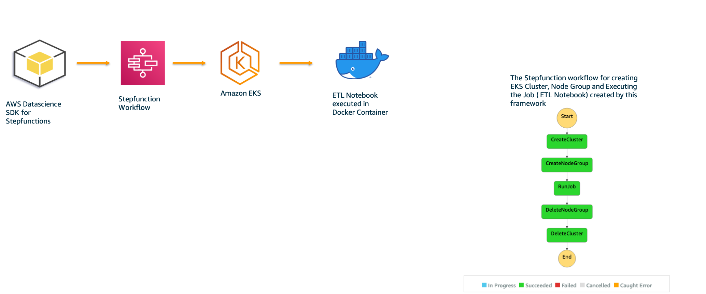

# aws-stepfunctions-eks-etl

The sample code provides the details of creating StepFunctions workflow statemachines with EKS for orchestration of ETL notebook execution. The notebooks are executed in a container in EKS.

As a Data Scientist or Developer, you need to concentrate on developing the notebooks. This framework will help to execute the notebook in EKS with Stepfunctions as orchestrator.

The repo is a template which you need to just use and replace the notebooks with your notebooks and update the config.yml file. Based on the config.yml details, stepfunction with EKS cluster and node group is created dynamically and programmatically. The job is then executed and the cluster is deleted.

The framework is developed using AWS Datascience SDK for Step Functions with the Service Integration API for EKS. The details of Step function integration with Amazon EKS can be viewed in the blog at https://aws.amazon.com/blogs/containers/introducing-aws-step-functions-integration-with-amazon-eks/

The details of the SDK for creating Stepfunctions with Amazon EKS as step is available at https://aws-step-functions-data-science-sdk.readthedocs.io/en/stable/services.html#amazon-eks

## Pre-requisites:

1. You need to have AWS Account and setup Access keys. Have the access id, secret key and region set as environment variables AWS_ACCESS_KEY_ID, AWS_SECRET_ACCESS_KEY and AWS_DEFAULT_REGION respectively.
2. You need to have AWS CLI2 installed already. Use this link https://docs.aws.amazon.com/cli/latest/userguide/getting-started-install.html for the steps to install AWS CLI.
3.  Docker (To do build docker image)

## Architecture

## Usage
To try out the framework and see its work in action, do the following:

1. Clone the repo. **git clone https://github.com/aws-samples/aws-stepfunctions-eks-datasciencesdk-etl.git**
2. cd aws-stepfunctions-eks-etl
3. Update the config.yml accordingly for Cluster name, Security Group, Subnet Id, Instance Type and Scaling Group. You can use the 
security group and subnet ids from the VPC if you have it already. Otherwise, you can use the following link https://docs.aws.amazon.com/eks/latest/userguide/creating-a-vpc.html
to create a VPC for Amazon EKS Cluster. After VPC has been created, you can use the security group and subnet ids created by the CloudFormation Template.
4. Create virtual env using the command,  **python3 -m venv venv**
5. Activate, the venv using the command, **source  venv/bin/activate**
6. Install the dependent python modules required using the command **pip install -r venv_requirement.txt**
7. Set the environment variables Example: export AWS_DEFAULT_REGION=us-west-1, export AWS_ACCESS_KEY_ID=your access key id, export AWS_SECRET_ACCESS_KEY=your access key
8. Provide executable permission , **chmod +x deploy.sh** 
9. Execute script **./deploy.sh**
10. Login to the AWS Console, Goto Step functions, Statemachines. You would be able to see state machine created dynamically based on the information from config.yml. 

## User-Experience

The users who want to on-board this framework to execute their notebook in EKS, need to do the following:

1. Clone the repo
2. Place your jupyter notebooks at src/notebooks
3. If your notebooks requires any 3rd party python modules, specify them in the requirements.txt
4. Update the config.yml file for Cluster name, Security group, Subnet Id, Instance Type and Scaling Config (Desired, Min and Max size)

Note: The dataset (US States 2010 and 2020 population) used in this repo is obtained from Wikipedia - https://en.wikipedia.org/wiki/List_of_U.S._states_and_territories_by_population

